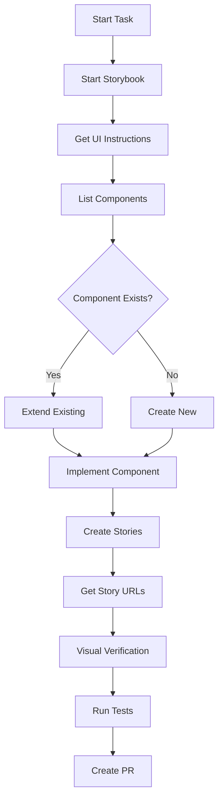

# 🎨 Storybook MCP Integration Setup Guide

Complete installation and configuration guide for integrating the official Storybook MCP addon with your Singularity agent workflow.

## 📋 Prerequisites

- **Node.js:** 24+ (check with `node --version`)
- **Storybook:** 9.1.16 or higher
- **Framework:** Must use Vite-based setup (react-vite, nextjs-vite, sveltekit)
- **Package Manager:** npm, pnpm, or yarn

## 🚀 Installation

### Step 1: Install Storybook MCP Addon

```bash
# Using Storybook CLI (recommended)
npx storybook add @storybook/addon-mcp

# Or manually
npm install --save-dev @storybook/addon-mcp
# or
pnpm add -D @storybook/addon-mcp
```

### Step 2: Configure Storybook

Create or update `.storybook/main.js` (or `.storybook/main.ts`):

```javascript
export default {
  stories: ['../src/**/*.stories.@(js|jsx|ts|tsx)'],
  
  addons: [
    '@storybook/addon-essentials',
    {
      name: '@storybook/addon-mcp',
      options: {
        // Enable development tools
        toolsets: {
          dev: true,   // get-ui-development-instructions, get-story-urls
          docs: true   // list-all-components, get-component-documentation
        },
        
        // Output format for MCP responses
        experimentalFormat: 'markdown'  // Options: 'markdown' (default) or 'xml'
      }
    }
  ],
  
  features: {
    // Required for component manifest generation (docs toolset)
    experimentalComponentsManifest: true
  },
  
  framework: {
    name: '@storybook/react-vite',
    options: {}
  }
};
```

### Step 3: Configure VSCode MCP

Update or create `.vscode/mcp.json`:

```json
{
  "servers": {
    "singularity-core": {
      "type": "stdio",
      "command": "node",
      "args": [
        "/run/media/mei/neo/singularity/mcp/index.js"
      ]
    },
    "storybook-addon-mcp": {
      "type": "http",
      "url": "http://localhost:6006/mcp",
      "transport": "streamable-http"
    }
  },
  "inputs": []
}
```

**Important Notes:**
- The Storybook MCP server runs as an HTTP endpoint, NOT stdio
- Default Storybook port is 6006
- MCP endpoint is at `/mcp` path
- Remove any incorrect stdio configuration for Storybook

### Step 4: Update Package Scripts

Add or verify these scripts in your root `package.json`:

```json
{
  "scripts": {
    "storybook": "storybook dev -p 6006",
    "build-storybook": "storybook build"
  }
}
```

## 🔧 Usage

### Starting Storybook with MCP

```bash
# Start Storybook dev server (includes MCP endpoint)
npm run storybook

# Storybook UI: http://localhost:6006
# MCP endpoint: http://localhost:6006/mcp
```

### Verifying MCP Connection

Test the MCP server with curl:

```bash
# List available tools
curl -X POST http://localhost:6006/mcp \
  -H "Content-Type: application/json" \
  -d '{
    "jsonrpc": "2.0",
    "id": 1,
    "method": "tools/list",
    "params": {}
  }'

# Test get-ui-development-instructions
curl -X POST http://localhost:6006/mcp \
  -H "Content-Type: application/json" \
  -d '{
    "jsonrpc": "2.0",
    "id": 2,
    "method": "tools/call",
    "params": {
      "name": "get-ui-development-instructions",
      "arguments": {}
    }
  }'

# Test list-all-components
curl -X POST http://localhost:6006/mcp \
  -H "Content-Type: application/json" \
  -d '{
    "jsonrpc": "2.0",
    "id": 3,
    "method": "tools/call",
    "params": {
      "name": "list-all-components",
      "arguments": {}
    }
  }'
```

### Available MCP Tools

| Tool Name | Toolset | Description |
|-----------|---------|-------------|
| `get-ui-development-instructions` | dev | Returns project UI conventions and best practices |
| `get-story-urls` | dev | Gets direct URLs to specific stories for visual verification |
| `list-all-components` | docs | Lists all components with metadata and props |
| `get-component-documentation` | docs | Fetches detailed docs for a specific component |

## 🎯 Agent Workflow Integration

### Pre-Development Checklist

Before starting UI work, your agent should:

1. **Start Storybook** (if not running):
   ```
   start_service("npm run storybook", 6006)
   ```

2. **Get UI conventions**:
   ```
   Call Storybook MCP: get-ui-development-instructions
   ```

3. **Discover existing components**:
   ```
   Call Storybook MCP: list-all-components
   ```

4. **Review similar components**:
   ```
   Call Storybook MCP: get-component-documentation
   Arguments: { componentName: "Button" }
   ```

### Component Development Flow



## 📝 Story File Template

Create comprehensive stories for all components:

```typescript
// Button.stories.tsx
import type { Meta, StoryObj } from '@storybook/react';
import { Button } from './Button';

const meta: Meta<typeof Button> = {
  title: 'Components/Button',
  component: Button,
  parameters: {
    layout: 'centered',
  },
  tags: ['autodocs'],
  argTypes: {
    variant: {
      control: 'select',
      options: ['primary', 'secondary', 'outline'],
    },
    size: {
      control: 'select',
      options: ['sm', 'md', 'lg'],
    },
  },
};

export default meta;
type Story = StoryObj<typeof Button>;

export const Primary: Story = {
  args: {
    variant: 'primary',
    children: 'Button',
  },
};

export const Secondary: Story = {
  args: {
    variant: 'secondary',
    children: 'Button',
  },
};

export const Large: Story = {
  args: {
    size: 'lg',
    children: 'Large Button',
  },
};

export const Loading: Story = {
  args: {
    isLoading: true,
    children: 'Loading',
  },
};

export const Disabled: Story = {
  args: {
    disabled: true,
    children: 'Disabled',
  },
};
```

## 🐛 Troubleshooting

### MCP Tools Not Available

**Symptom:** Agent cannot call Storybook MCP tools

**Solutions:**
1. Verify Storybook is running: `curl http://localhost:6006`
2. Check MCP endpoint: `curl http://localhost:6006/mcp`
3. Ensure `@storybook/addon-mcp` is in `.storybook/main.js` addons array
4. Restart Storybook after configuration changes

### Empty Component List

**Symptom:** `list-all-components` returns no components

**Solutions:**
1. Enable manifest in `.storybook/main.js`:
   ```javascript
   features: {
     experimentalComponentsManifest: true
   }
   ```
2. Ensure stories use `tags: ['autodocs']`
3. Verify story files match the stories glob pattern
4. Rebuild Storybook: `npm run build-storybook`

### Wrong Framework Error

**Symptom:** Addon fails to load or shows compatibility warnings

**Solution:** Ensure you're using a Vite-based framework:
```javascript
framework: {
  name: '@storybook/react-vite',  // ✅ Supported
  // name: '@storybook/react-webpack5',  // ❌ Not supported
}
```

### Port Conflicts

**Symptom:** Storybook fails to start on port 6006

**Solutions:**
1. Check for running processes: `lsof -i :6006`
2. Use different port: `storybook dev -p 6007`
3. Update MCP config to match new port

### MCP Connection Timeout

**Symptom:** VSCode Copilot cannot connect to Storybook MCP

**Solutions:**
1. Verify correct URL in `.vscode/mcp.json`: `http://localhost:6006/mcp`
2. Ensure transport is `streamable-http`, not `stdio`
3. Check firewall/network settings
4. Restart VSCode and Storybook

## 📚 Additional Resources

- [Official Storybook MCP GitHub](https://github.com/storybookjs/mcp)
- [Storybook Documentation](https://storybook.js.org/docs)
- [MCP Protocol Specification](https://github.com/anthropics/mcp)
- [Storybook Vite Builder](https://storybook.js.org/docs/builders/vite)

## ✅ Validation Checklist

Before considering setup complete:

- [ ] `@storybook/addon-mcp` installed
- [ ] `.storybook/main.js` configured with addon and features
- [ ] `.vscode/mcp.json` configured with HTTP endpoint
- [ ] Storybook starts successfully on port 6006
- [ ] MCP endpoint responds: `curl http://localhost:6006/mcp`
- [ ] Can call `get-ui-development-instructions` successfully
- [ ] Can call `list-all-components` and see components
- [ ] Agent configuration files updated with Storybook workflow
- [ ] Test component + story created and visible in Storybook

---

**Note:** The MCP addon only works when Storybook dev server is running. Always start Storybook before attempting UI development with AI agents.